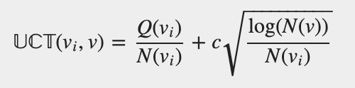
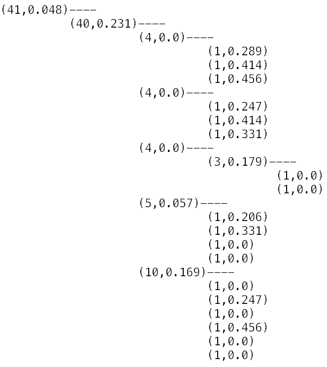
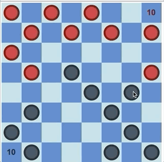
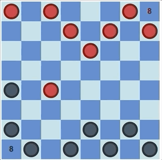

# Monte-Carlo Tree Search for checkers game

## Installation

These scripts ran on Mac with python 3.7.6 using only Turtle and Numpy packages.

## Content

  * **Checkers** game with **graphical interface** with 2 possible rules: with and without forced take (jump)
  * **MCTS** model with customized **reward designs**, **thinking time** and with option to use or not **transfer of knowledge** (MCTS player reuses relevant branches from former built tree according to current boardgame). We used the following Upper Confidence Bound (UCB) formula:

 
 It is also possible to visualize the tree with number of visits and average reward at each state.
 

  * 3 Different **modes**: MCTS vs MCTS, User vs MCTS, MCTS vs Random
  
### MCTS vs MCTS

  

  demo: 0.5s MCTS (black) vs 1s MCTS (red)

### User vs MCTS

  

### MCTS vs Random

  

  demo: 0.5s MCTS (black) vs Random player (red)

